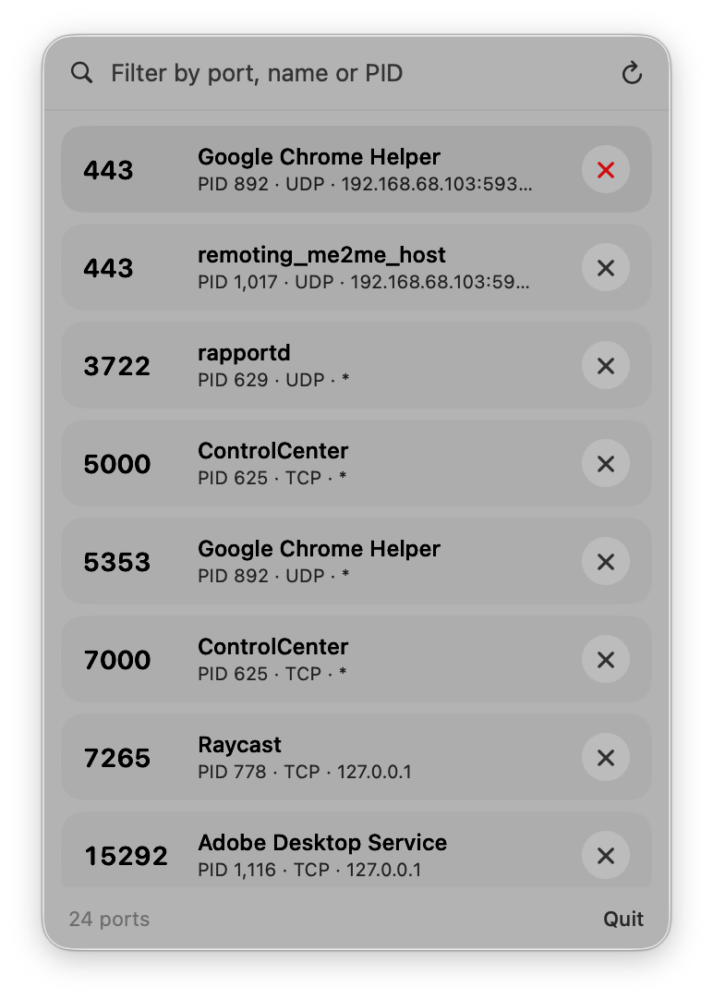
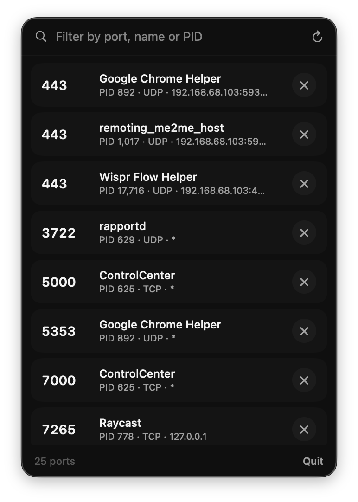

# pkill

A tiny macOS menu bar app for finding and killing whatever is squatting on a port.

Your app won't start because "port 3000 is already in use"? Some old server is still running and you have no idea where. Just click the menu bar icon, find the port, and tap ✕. Done — no scary terminal commands, no Googling what `lsof` even means.

<p align="center">
  
</p>

<p align="center">
  
  &nbsp;&nbsp;
  
</p>

## Features

- **Lists every listening port** (TCP and UDP) with the owning process, PID, protocol, and bind address.
- **Filter as you type** by port number, process name, or PID.
- **One-click kill** — sends `SIGTERM`, then escalates to `SIGKILL` if the process is still alive after a short grace period.
- **Lives in the menu bar** — no Dock icon, no window clutter (`LSUIElement`).
- Native SwiftUI with the macOS glass look.

## Requirements

- macOS 26 (Tahoe) or later
- For building: Swift 6.2+ toolchain (Xcode 26 or the matching command-line tools)

## Install

### From a release

Download `pkill.dmg`, open it, and drag **pkill** to **Applications**.

The app is ad-hoc signed (not notarized), so the first launch needs Gatekeeper approval:
right-click **pkill.app → Open**, then confirm. Or run `xattr -dr com.apple.quarantine /Applications/pkill.app`.

### Build from source

```bash
git clone https://github.com/pankan/pkill.git
cd pkill
./build.sh           # builds release + assembles pkill.app
open pkill.app
```

To produce the distributable disk image:

```bash
./make_dmg.sh        # builds the app and packages pkill.dmg
```

You can also run it straight from SwiftPM during development:

```bash
swift run
```

## Usage

1. Click the **power plug** icon in the menu bar.
2. Browse the list of listening ports, or type to filter.
3. Click **✕** next to an entry to kill the process holding that port.
4. The list refreshes automatically after a kill; hit the ↻ button to rescan manually.

Killing a process you don't own will fail silently — the port simply won't free up. Run the
app as your own user for your own dev servers; system processes are left to the system.

## How it works

`pkill` shells out to `/usr/sbin/lsof` to enumerate listening sockets (`-iTCP -sTCP:LISTEN`
and `-iUDP`), parses the `-F` field output into one entry per `(pid, port)`, and uses the
`kill(2)` syscall to terminate processes. There is no privileged helper and no network access.

### Project layout

| Path | Purpose |
|------|---------|
| `Sources/pkill/App.swift` | App entry point and `MenuBarExtra` scene |
| `Sources/pkill/ContentView.swift` | Menu UI — list, filter, footer, rows |
| `Sources/pkill/PortStore.swift` | Observable state, scanning, and kill orchestration |
| `Sources/pkill/PortScanner.swift` | `lsof` invocation, parsing, and `kill(2)` |
| `build.sh` | Builds the binary and assembles the `.app` bundle |
| `make_dmg.sh` | Builds and packages a styled `.dmg` |
| `scripts/make_icon.swift` | Renders `AppIcon.icns` |
| `scripts/make_bg.swift` | Renders the DMG background |

## Contributing

Issues and pull requests are welcome. Keep changes small and in the spirit of the app —
it's deliberately minimal.

## License

[MIT](LICENSE)
